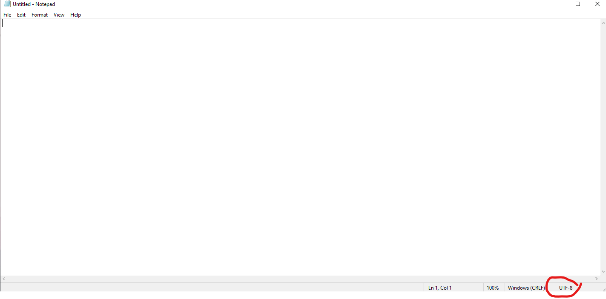
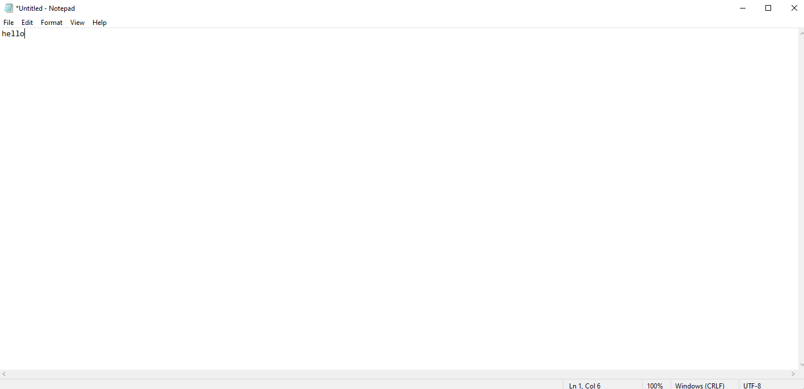
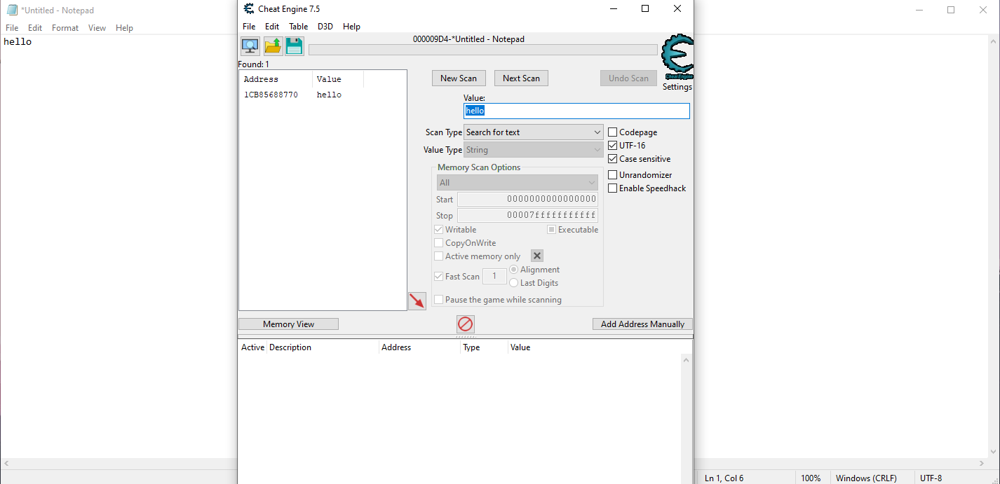

# Notepad tapper

_Sep 1 2024_

**Disclaimer: The techniques discussed here work on Windows 10 notepad, but not Windows 11 notepad**

## Introduction
In this blog, I'll discuss how you can change data displayed on notepad process using code, and then showcase a simple space shooter game for notepad. We'll use windows api and Cheat Engine to achieve this. For more information of Cheat Engine, please visit: <a href="https://wiki.cheatengine.org/index.php?title=Tutorials:Cheat_Engine_Tutorial_Guide_x64">https://wiki.cheatengine.org/index.php?title=Tutorials:Cheat_Engine_Tutorial_Guide_x64</a>. This blog is inspired by <a href="https://kylehalladay.com/">Kyle Halladay</a>'s post: <a href="https://kylehalladay.com/blog/2020/05/20/Hooking-Input-Snake-In-Notepad.html">Hooking Keyboard Input To Play Snake In Notepad.exe</a>

## Initial Observe
With Cheat Engine, we can find the address of specific word within notepad process (what we're trying to do). As of notepad, though it specifically say UTF_8 at the bottom right corner, data is actually encoded by UTF_16.



How we know it? Let's examine using Cheat Engine. Let's try to find address of hello in the memory



Fire up Cheat Engine and search for ```hello``` in UTF_8 we have nothing in return


However, if we change the search to UTF_16, an address pops up



Change value of this memory address will result in change in notepad process. With this in mind, we'll use code to automate our process. First, we'll try to find the memmory address associated with a value matched target pattern. Then. we'll try to change the value, and update the windows.

## Find pattern
VirtualQueryEx will help us run through all memmory address of target process (region size, data, premission, ...). We then check if the region has COMMIT and READWRITE permission. Once we capture all of those region, we'll initiate our find pattern function to find our target address. 

```cpp
char* GetProcessMemory(DWORD proc_id, char *pattern, size_t patternLen){
  HANDLE hproc = OpenProcess(PROCESS_ALL_ACCESS, false, proc_id);
  LPVOID base = 0x0;
  MEMORY_BASIC_INFORMATION memInfo;
  size_t bytesread;

  int skip = 0;

  while (VirtualQueryEx(hproc, base, &memInfo, sizeof(memInfo))){
    if (skip > 4){
      if (memInfo.State == MEM_COMMIT && memInfo.Protect == PAGE_READWRITE){
        char *lpBuffer = (char *)malloc(memInfo.RegionSize);

        ReadProcessMemory(hproc, base, lpBuffer, memInfo.RegionSize, NULL);
        char* match = FindPattern(lpBuffer, memInfo.RegionSize, pattern, patternLen);
        
        if (match){
            uint64_t diff = (uint64_t)match - (uint64_t)(lpBuffer);
            char* processPtr = (char *)base + diff;
            return processPtr;
        }
      }
    }
    // cout << endl << endl;

    skip ++;
    base += memInfo.RegionSize;
  }

  return nullptr;
}
```

To find pattern, first we'll initiate a pointer, ```ptr```, points to the base address of target region. Then we'll move up until ```ptr``` is region size away from the base address. This can be done using this code:

```cpp
char* FindPattern(char* src, size_t srcLen, const char* pattern, size_t patternLen){
	char* cur = src;
	size_t curPos = 0;

	while (curPos < srcLen){
		if (memcmp(cur, pattern, patternLen) == 0){
			return cur;
		}

		curPos++;
		cur = &src[curPos];
	}
	return nullptr;
}
```

Next up, it's time to change the value and we all done.

## Change value
There's a problem with changing value in memory address:
1) Value is changed but notepad's display may not be updated immediately. Manual interact with notepad process is required.
2) Region size is fixed. Updated value is constrained within that box.

Tackling (1) is not that hard. Windows offers InvalidateRect functionality, which can force a process's window to update.

```cpp
bool UpdateProcessMemory(DWORD proc_id, LPVOID base, size_t size){
    HANDLE hproc = OpenProcess(PROCESS_ALL_ACCESS, false, proc_id);
    MEMORY_BASIC_INFORMATION memInfo;

    // char *payload = UTF16Convert((char *)target.c_str());

    if(!WriteProcessMemory(hproc, base, buffer, size, NULL)){
        return false;
    }

    RECT r;
    GetClientRect(notepad_hwnd, &r);
    InvalidateRect(notepad_hwnd, &r, false);
    return true;
}
```

Let's get into space shooter for notepad

## Space shooter
Each line in notepad associates with one memory address. To make a game, we'll need to have the control of entire screen or notepad windows. To achieve this, the simplest way is to enable word wrap in notepad; we just have to deal with 1 giant word (1 memory address). 

However, recording keyboard input is not that easy. There's one way we can global hook keyboard; however, this will make anytime we press a key, an action will be initiated to space shooter game, no matter if we have notepad process as active window or not. To achieve this, we can install hook inside notepad process, then use socket api to transfer key stroke out to the main program to update space shooter.

Our plan here in general is to build a dll that acts both like a keystroke capture and a socket client. We'll then hook that dll into notepad process. 
```SetWindowsHookExA``` really actually helps hook keyboard with a dll. Payload dll should be loaded first by ```LoadLibraryA```. Once it's loaded, export function will be accessible to main program, whose address got by ```GetProcessAddress``` can be used in ```SetWindowsHookExA```.

```cpp
void InstallHook(DWORD thread_id){
  TCHAR dll_path[MAX_PATH];

  GetFullPathName(TEXT("./keyboard_dll.dll"), MAX_PATH, dll_path, NULL);

  cout << dll_path << endl;

  HMODULE hooklib = LoadLibraryA((LPCSTR)dll_path);
  HOOKPROC hookfunc = (HOOKPROC)GetProcAddress(hooklib, "HookProcedure");

  HHOOK keyboardhook = SetWindowsHookExA(WH_KEYBOARD, hookfunc, hooklib, thread_id);

  cout << "Run" << endl;
  while(GetMessage(NULL, NULL, WM_KEYFIRST, WM_KEYLAST)){}

  UnhookWindowsHookEx(keyboardhook);
}
```

I'll not discuss how to set up socket server and client using windows api here, but this documentation might help: <a href="https://learn.microsoft.com/en-us/windows/win32/winsock/complete-client-code">Socket Client</a> and <a href="https://learn.microsoft.com/en-us/windows/win32/winsock/complete-server-code?source=recommendations">Socket Server</a>

Putting it all together, <a href="https://github.com/mdphuc/myfile/blob/main/Notepad%20tapper/keyboardhook_dll.cpp">dll</a> and <a href="https://github.com/mdphuc/myfile/blob/main/Notepad%20tapper/server.cpp">server</a> code can be found in my Github repo

I'll not discuss in detail the logic of game shooter here, but the code for it can be found in my <a href="https://github.com/mdphuc/myfile/tree/main/Notepad%20tapper/game_logic">Github</a> repo as well

The full code can be found <a href="https://github.com/mdphuc/myfile/tree/main/Notepad%20tapper">here</a>.

Here's some result:


